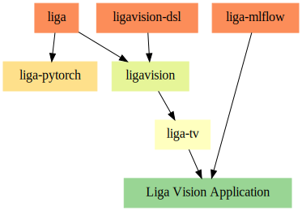

# PyTorch Model Flavor and Model Types on Liga
+ `liga-pytorch`: PyTorch Model Flavor on Liga
+ `liga-tv`: PyTorch Model Flavor and Torch Vision Model Types on Liga

## Usage And Architecture
```
pip install liga-tv
```

With `liga-tv`, one can analyze video via SQL and pre-trained PyTorch Vision models in a Liga way.

For ML Engineers who train their own PyTorch models and log the models into MLflow, `liga-mlflow` is suggested.



## Live Notebooks
### Try Locally (Suggested)
Try the live notebooks via:
```
# Please install JDK 8/11, Python 3.8/3.9 locally
git clone https://github.com/liga-ai/liga-pytorch.git
cd liga-pytorch && bin/lab
```
### Preview in Web Browser on Github (`click the links in the table`)
### Try in Web Browser on Google Colab (`click the badges in the table`)
## For Liga Vision
| Model Type (Short) | Model Type (Long) | Purpose | Preview Latest Notebook | Try Google Colab Notebook |
|-------|---------|-----|-----------|--------|
| convnext | `convnext_base` | Classification | [Demo](notebooks/convnext.ipynb) | <a href="https://colab.research.google.com/github/liga-ai/liga-pytorch/blob/main/notebooks/convnext.ipynb" target="_parent"></a> |
|          | `convnext_tiny` | | | |
|          | `convnext_small` | | | |
|          | `convnext_large` | | | |
| efficientnet | `efficientnet_b0` | Classification | [Demo](notebooks/efficientnet.ipynb) | <a href="https://colab.research.google.com/github/liga-ai/liga-pytorch/blob/main/notebooks/efficientnet.ipynb" target="_parent"></a>|
| | `efficientnet_b[1-7]` | | | |
| fasterrcnn | `fasterrcnn` | Object Detection | [Demo](notebooks/fasterrcnn.ipynb) | <a href="https://colab.research.google.com/github/liga-ai/liga-pytorch/blob/main/notebooks/fasterrcnn.ipynb" target="_parent"></a> |
| | `fasterrcnn_mobilenet_v3_large_320_fpn` | | |
| | `fasterrcnn_mobilenet_v3_large_fpn` | | |
| | `fasterrcnn_resnet50_fpn` | | |
| keypointrcnn | `keypointrcnn` | Object Detection | [Demo](notebooks/keypointrcnn.ipynb) | <a href="https://colab.research.google.com/github/liga-ai/liga-pytorch/blob/main/notebooks/keypointrcnn.ipynb" target="_parent"></a> |
| maskrcnn | `maskrcnn` | Object Detection | [Demo](notebooks/maskrcnn.ipynb) | <a href="https://colab.research.google.com/github/liga-ai/liga-pytorch/blob/main/notebooks/maskrcnn.ipynb" target="_parent"></a> |
| resnet | `resnet50` | Classification | [Demo](notebooks/resnet.ipynb) | <a href="https://colab.research.google.com/github/liga-ai/liga-pytorch/blob/main/notebooks/resnet.ipynb" target="_parent"></a> |
| | `resnet18` | | |
| | `resnet34` | | |
| | `resnet101` | | |
| | `resnet152` | | |
| ssd | `ssd` | Object Detection | [Demo](notebooks/ssd.ipynb) | <a href="https://colab.research.google.com/github/liga-ai/liga-pytorch/blob/main/notebooks/ssd.ipynb" target="_parent"></a> |
| | `ssdlite` | | |
